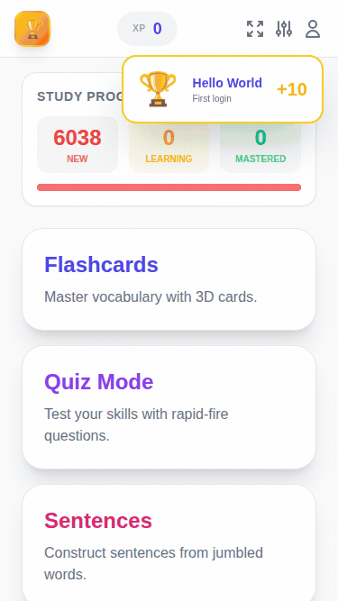
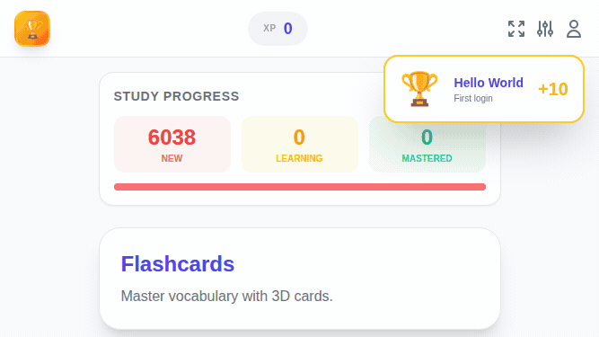

# Polyglot.AI

**Polyglot.AI** is a robust, web-based language learning ecosystem built to help users master vocabulary and sentence structure through **16 interactive game modes**. It leverages Firebase for real-time data and authentication, offering a highly customizable experience with support for complex scripts (Japanese, Chinese, Korean) and intelligent audio handling.

<p align="center">
  
  
</p>

---

## Tech Stack

- **Frontend**: Vanilla JS (ES Modules), Webpack 5 (code-split chunks), Tailwind CSS 3.4
- **Backend**: Firebase Realtime Database (v9+ modular SDK), Firebase Auth (Google + Anonymous)
- **PWA**: Service Worker with cache-first strategy and IndexedDB offline write queue
- **AI**: Ollama-compatible LLM integration for dynamically generated exercises and AI Tutor chat
- **Testing**: Vitest + jsdom (101 unit tests)
- **Deployment**: Firebase Hosting
- **Responsive**: Portrait + landscape layouts for mobile, tablet, and desktop via custom `landscape:` Tailwind variant

---

## File Structure & Architecture

The application uses a modular architecture with services handling business logic, managers orchestrating state, and components handling game UI. All 16 game components extend a shared `BaseGameComponent` base class.

| File Path | Description |
| :--- | :--- |
| **`src/index.html`** | SPA shell with main menu, settings modals, and dynamic view containers for all 16 game modes. |
| **`src/index.js`** | Entry point. Initializes core services (vocab, score, SRS) and managers (View, Auth, UI). |
| **`src/sw.js`** | Service Worker (v4). Network-first for vocab data, stale-while-revalidate for JS bundles, cache-first for app shell. |
| **`src/config/roles.js`** | Configurable admin email list with `isAdmin(user)` helper. |
| **`src/config/gameTypes.js`** | Game type constants used by score service and database paths. |
| **`src/utils/sanitize.js`** | HTML/JS sanitization utility (`escapeHTML`). |
| **`src/managers/`** | App-wide orchestrators: |
| | **`ViewManager.js`** — SPA router with `history.pushState`, dynamic code-split imports for all 16 games. |
| | **`AuthManager.js`** — Firebase user sessions, Google sign-in, anonymous-to-permanent data migration. |
| | **`UIManager.js`** — Delegates to ScoreChartManager, AchievementManager, and SettingsManager. |
| | **`ScoreChartManager.js`** — Weekly score chart rendering, daily/weekly toggle, bar tooltips. |
| | **`AchievementManager.js`** — Achievement popup notifications and achievement list modal. |
| | **`SettingsManager.js`** — Settings modal, dark mode, volume, language selects, per-game settings, AI config. |
| | **`EditorManager.js`** — Admin content editing with lazy-loaded dictionary service. |
| | **`ComboManager.js`** — Streak state, fuse timer, draggable combo UI, 20 rank tiers with particle effects. |
| **`src/services/`** | Core business logic: |
| | **`textService.js`** — CJK text processing, fitText (binary search), tokenization, smart wrapping with overflow fallback. |
| | **`audioService.js`** — TTS via Web Speech API with language-specific voice selection. |
| | **`vocabService.js`** — Firebase realtime sync, language remapping (front/back faces), subscriber pattern. |
| | **`scoreService.js`** — Score tracking, daily stats, achievement triggers, streak tracking. |
| | **`srsService.js`** — Leitner-box spaced repetition (5 boxes, weighted random selection, due-item intervals). |
| | **`toastService.js`** — Toast/snackbar notifications (success/error/info/warning/confirm). |
| | **`achievementService.js`** — Gamification badges and unlock logic. |
| | **`settingsService.js`** — User preferences persisted to localStorage. |
| | **`dictionaryService.js`** — CJK dictionary lookups (lazy-loaded on first use). |
| | **`quizService.js`** — Multiple-choice quiz question generator. |
| | **`blanksService.js`** — Fill-in-the-blank question generator. |
| | **`aiService.js`** — Generic Ollama/OpenAI-compatible LLM chat client. |
| | **`aiContentService.js`** — AI-powered exercise generators (17 generators for all game modes). |
| | **`offlineQueue.js`** — IndexedDB-backed offline write queue, auto-flushes on reconnect. |
| | **`firebase.js`** — Firebase app initialization and re-exports. |
| **`src/components/`** | 16 game classes extending `BaseGameComponent`: FlashcardApp, QuizApp, BlanksApp, SentencesApp, ConstructorApp, FinderApp, MatchApp, MemoryApp, ListeningApp, WritingApp, TrueFalseApp, ReverseApp, SpeechApp, DecoderApp, GravityApp, ChatApp. |
| **`tests/`** | 6 unit test suites (101 tests): settingsService, srsService, toastService, sanitize, gameTypes, aiContentService. |

---

## Game Modes

| # | Game | Description |
| :- | :--- | :--- |
| 1 | **Flashcards** | 3D flip cards with smart text fitting, auto-audio, AI-generated hints & cultural notes |
| 2 | **Quiz** | 4-option multiple choice with double-click mode, AI-generated questions |
| 3 | **Sentences** | Build sentences from jumbled words; Japanese tokenization support |
| 4 | **Blanks** | Fill in the blank from contextual sentences |
| 5 | **Listening** | Audio-based comprehension with AI-generated passages |
| 6 | **Match** | Race to pair words with meanings |
| 7 | **Memory** | Find hidden pairs (flip-to-match) |
| 8 | **Finder** | 3x3 grid — find the word matching the clue |
| 9 | **Constructor** | Build words character-by-character |
| 10 | **Writing** | Type the translation with auto-check |
| 11 | **Review** (True/False) | Quick yes/no vocabulary checks |
| 12 | **Reverse Quiz** | Pick the word matching a definition |
| 13 | **Speech** | Pronunciation practice with speech recognition |
| 14 | **Decoder** | Listen and reconstruct words from scrambled characters |
| 15 | **Gravity** | Falling asteroids — tap correct words before they hit the ground |
| 16 | **AI Tutor** (Chat) | 5 chat modes (Conversation, Reading, Grammar, Vocabulary, Stories) with pronunciation feedback |

---

## Core Architecture

### BaseGameComponent

All 16 game components extend `BaseGameComponent`, which provides:

- **Lifecycle management**: `mount()`, `unmount()`, `refresh()` with auto-tracked timers and animation frames
- **Category filtering**: `updateCategories()`, `setCategory()`, `getFilteredList()`
- **Navigation**: `next()`, `prev()`, `random()`, `gotoId()` with SRS-weighted random selection
- **SRS integration**: `recordAnswer(vocabId, correct)` updates Leitner box levels
- **HTML rendering**: `renderHeader()`, `renderFooter()`, `renderCategoryPills()`, `renderError()`, `renderSplitLayout()`
- **Event binding**: `bindCommonEvents(prefix)` — uses **event delegation** (single listener per container)
- **Service accessors**: `vocabService`, `audioService`, `scoreService`, `settingsService`, `textService`, `toast`
- **Responsive layout**: `renderSplitLayout()` stacks vertically in portrait, splits 50/50 in landscape
- **Mobile keyboard**: `VisualViewport` API adjusts fixed bottom bars when keyboard opens
- **Touch targets**: Minimum 48px interactive elements across all games

### Spaced Repetition (SRS)

The app uses a Leitner-box system to prioritize weak vocabulary:

| Box | Weight | Meaning |
| :-- | :----- | :------ |
| 1 | 8x | New or incorrect — highest review priority |
| 2 | 4x | Early learning |
| 3 | 2x | Intermediate |
| 4 | 1x | Near mastery |
| 5 | 0.5x | Mastered — lowest priority |

- **Correct answer**: box goes up (max 5)
- **Wrong answer**: drops back to box 1
- **Random selection**: `weightedRandom()` picks items with lower boxes more frequently, with time-since-last-review multiplier
- **Data stored at**: `users/{uid}/srs/{vocabId}` = `{ box, lastReview }`
- **Games tracking answers**: Quiz, Writing, Reverse, Finder, TrueFalse, Listening, Constructor (7 games actively track; all 16 benefit from weighted random)

### Toast Notification System

Replaces all native `alert()` and `confirm()` calls with styled toast notifications:

- **Methods**: `toast.success()`, `toast.error()`, `toast.info()`, `toast.warning()`
- **Confirm dialog**: `await toast.confirm(message)` returns a Promise (true/false)
- **Auto-dismiss**: Configurable duration with slide-in/out animations

---

## Text & Language Algorithms

### Special Character Handling & Smart Wrap
The application scans for special separators (`/`, `·`, `・`, `･`, `,`, `、`, `。`) to optimize display:

- **Grid layouts** (Finder, Match, Memory): Splits and stacks synonyms vertically
- **Constructor game**: Strips separators, randomly selects one variation for spelling
- **Memoized**: `smartWrap()` results are cached by input string to avoid redundant processing

### fitText Algorithm (Binary Search)
Dynamically sizes text to fill its container using **binary search** (O(log n) instead of linear scan):

1. Starts at `max` font size, binary-searches between min and max for the best fit
2. For flashcards: temporarily sets explicit height before measurement, then clears it
3. Text starts with `opacity-0` and fades in after sizing to prevent flash of unstyled content
4. **Overflow fallback**: If text cannot fit at minimum size, wrapping is automatically enabled

### Language-Specific Tokenization
- **Japanese**: Custom morphological tokenizer (`textService.tokenizeJapanese`) using `Intl.Segmenter`
- **Post-processing**: Merges punctuation and particles for natural sentence segments
- **Multi-language**: Sentence Builder supports English, French, Spanish, German, Italian, Portuguese structural word detection

---

## Settings & Customization

| Section | Settings |
| :--- | :--- |
| **Language** | Target / Origin language selectors |
| **Audio** | Auto-Play, Wait for Audio, Touch-to-Speak, Volume slider |
| **Card Visuals** | Show Reading, Show Sentence, Show English |
| **Quiz** | Double Click mode, Auto-Play correct answer |
| **Sentences** | Win Animation, Word Audio on Tap |
| **Blanks** | Double Click, Answer Audio, Auto-Play Correct |
| **Effects** | Combo Streak Effects toggle (rank display + particles) |
| **AI Tutor** | Ollama URL (default `http://localhost:60879`), Model selector |

---

## AI Integration (Ollama)

Polyglot.AI integrates with any OpenAI-compatible LLM server (Ollama recommended):

- **Dynamic content**: AI generates hints, cultural notes, example sentences, and full exercises for each game mode
- **17 generators**: One per game mode + comprehension questions and cultural notes
- **Configurable**: Set server URL and model in Settings (default: `llama3.2:3b`)
- **Graceful fallback**: If AI is unavailable, games use built-in content
- **Abort controller**: AI requests are cancelled on navigation for responsiveness

---

## Combo System

### Decaying Fuse Timer
- 5-second fuse; expiry drops to previous rank threshold (not full reset)
- Timer pauses during TTS audio playback

### Right-Anchored Drag Physics
- Combo UI position stored relative to right edge — survives resize/rotation

### Progressive Rank Effects (20 ranks, toggleable)
- **A+**: Screen flash
- **S**: Random paint splats
- **SS**: Animated dancers
- **SSS+**: Gold rain particle simulation
- **H–G**: Higher tiers with increasing visual intensity
- All effects can be disabled via **Effects** settings toggle

---

## Firebase Realtime Database

### Realtime Data Sync
`vocabService` attaches an `onValue()` listener. When data changes server-side, all active game components receive updates via the subscriber pattern and call `refresh()`.

### Offline Support
- **Service Worker** caches vocab data and app shell for offline access
- **Offline Queue** (`offlineQueue.js`) writes pending score/SRS updates to IndexedDB, auto-flushes on reconnect

### Database Structure

#### `vocab` Node
```json
{
  "id": 0,
  "ja": "洗剤", "ja_furi": "せんざい", "ja_roma": "senzai",
  "en": "detergent", "en_ex": "Use only...",
  "ko": "세제", "zh": "洗衣粉",
  "category": "Household"
}
```

#### `dictionary` Node
```json
{ "id": 1, "s": "个", "t": "个", "p": "gè", "e": "piece...", "k": "낱 개" }
```

#### `users/{uid}` Node
```json
{
  "stats": {
    "01-15-2025": { "quiz": 50, "flashcard": 10 },
    "total": { "score": 1200, "quiz": 800, "quiz_wins": 160 }
  },
  "achievements": { "first_login": { "unlockedAt": 1700000000000 } },
  "srs": { "42": { "box": 3, "lastReview": 1700000000000 } }
}
```

### Security Rules
- **`vocab` / `dictionary`**: Authenticated read, admin-only write
- **`users/$uid`**: Owner read/write only
- **`stats` / `srs` / `achievements`**: Validated shape and number types

---

## Service Worker (PWA)

Version 4 with four caching strategies:

| Strategy | Scope | Behavior |
| :--- | :--- | :--- |
| Cache-first | App shell (`/`, `index.html`, icons) | Serve from cache, update in background |
| Stale-while-revalidate | JS bundles (`*.js`, `*.chunk.js`) | Serve cached, fetch fresh copy for next load |
| Network-first | Vocab data (`polyglot-data` cache) | Try network, fall back to cache for offline |
| Cache-first (fonts) | Google Fonts | Persistent font caching |
| Bypass | Firebase API, Google APIs | Always fetch from network |

---

## Performance Optimizations

| Optimization | Detail |
| :--- | :--- |
| **Binary search fitText** | O(log n) font sizing instead of linear scan — up to 190x fewer layout reflows |
| **SmartWrap memoization** | Regex split results cached by input string |
| **Event delegation** | Single click listener per container vs N individual listeners |
| **CSS transforms** | Gravity asteroid movement uses GPU-composited `translateY` |
| **Code splitting** | Each game is a separate webpack chunk, loaded on demand |
| **Firebase chunk** | Firebase SDK split into its own vendor chunk |
| **Will-change hint** | Gravity asteroids use `will-change: transform` for GPU layer promotion |
| **Overscroll containment** | Game views prevent pull-to-refresh and rubber-banding |

---

## Testing

101 unit tests across 6 suites using **Vitest** with **jsdom**:

```bash
npm test          # Run all tests
npx vitest        # Watch mode
```

| Test File | Tests | Coverage |
| :--- | :--- | :--- |
| `tests/aiContentService.test.js` | 69 | AI exercise generator parsing & fallback |
| `tests/settingsService.test.js` | 4 | Defaults, set/persist, merge, corrupted localStorage |
| `tests/srsService.test.js` | 11 | Box defaults, correct/wrong answers, cap at 5, weighted random distribution |
| `tests/toastService.test.js` | 7 | Container creation, toast elements, auto-remove, confirm promise |
| `tests/sanitize.test.js` | 7 | HTML escaping, XSS prevention |
| `tests/gameTypes.test.js` | 3 | Game type constants |

---

## Development

```bash
npm install       # Install dependencies
npm start         # Start dev server (webpack-dev-server, port 8080)
npm run build     # Production build
npm test          # Run unit tests
```

## Deployment

```bash
npm run build                    # Build production bundle
npx firebase deploy              # Deploy to Firebase Hosting
npx firebase deploy --only database  # Deploy database rules only
```
